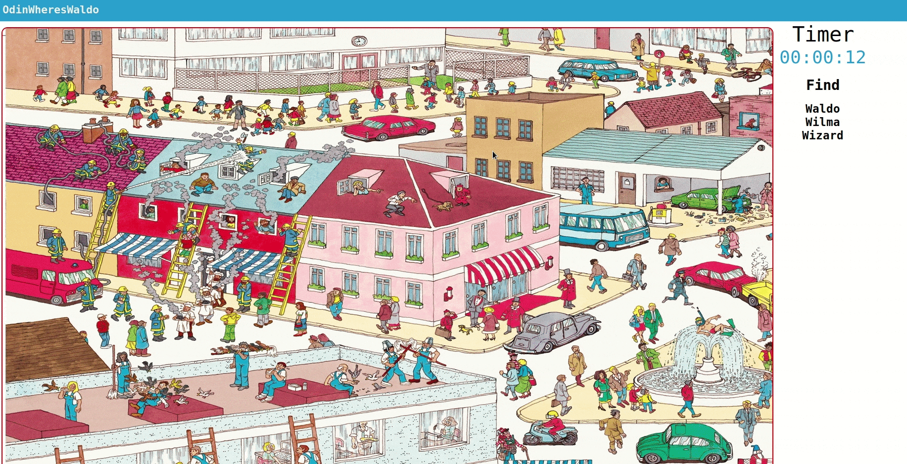

# OdinWheresWaldo

> Ruby on Rails project

Learn more about the project specifications [here](https://www.theodinproject.com/courses/javascript-and-jquery/lessons/where-s-waldo-a-photo-tagging-app)

App is [live](https://odinwhereswaldo.herokuapp.com/)

## Demo



## Instructions

> Make sure you have [PostgreSQL](https://www.postgresql.org/) and a JavaScript runtime like [Node](https://nodejs.org/) installed.

1. clone the repository

   `git clone git@github.com:ben-garcia/odin_wheres_waldo.git`

2. create `config/application.yml`:

   `bundle exec figaro install`

   and setup environment variables there

   ```
    DB_USERNAME: < your_postgresql_username >
    DB_PASSWORD: < your_postgresql_password >
   ```

   **OR**

   open `config/database.yml` and type your postgreSQL credentials

   ```
   ...

   development:
     <<: *default
     database: wheres_waldo_development
     username: < your_postgresql_username >
     password: < your_postgresql_password >

   ...
   ```

3. run `bundle` to install gems

4. run `rails db:create` to create database

5. run `rails: db:migrate` to create tables

6. run `rails db:seed` to populate the tables

7. run `rails s` to run server on `localhost:3000`
